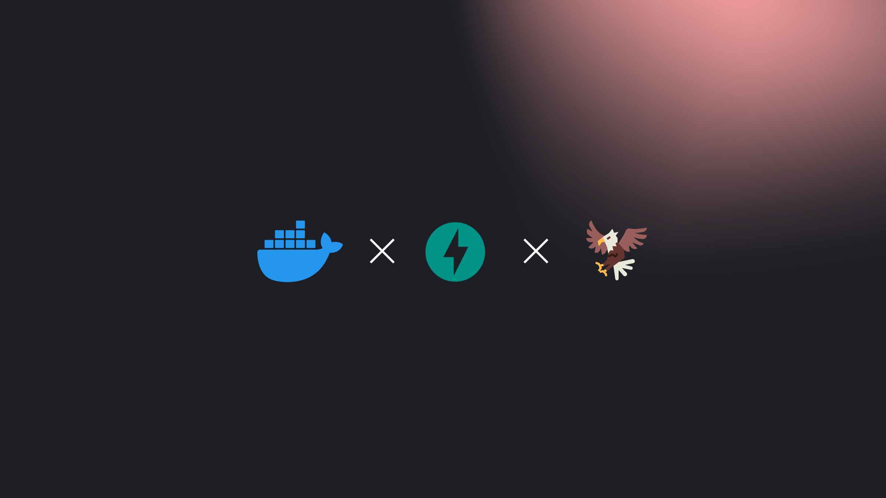

<head>
  <meta name="twitter:image" content="./banner.jpg"/>
</head>

In this tutorial, we will walk you through the process of serving the Falcon 7B Instruction model using FastAPI and Docker. The complete code for this tutorial is available on GitHub.

> NOTE: in order to run Falcon 7B Instrcut model you will need a GPU with at least 16GiB of VRAM. You can use a [Paperspace Cloud](https://www.paperspace.com/gpu-cloud) virtual server or any other cloud provider or your own server with a NVIDIA GPU.

### Step 1: Setup the Python Server

First, we need to create a requirements.txt file to list all the necessary dependencies. This file will include libraries such as FastAPI, uvicorn, pytest, requests, tqdm, httpx, python-dotenv, tenacity, einops, sentencepiece, accelerate, and xformers.

#### 1. Create `requirements.txt` file.

Create a `requirements.txt` file with the following dependencies:

```txt
fastapi==0.95.0
uvicorn==0.21.1
pytest==7.2.2
requests==2.28.2
tqdm==4.65.0
httpx==0.23.3
python-dotenv==1.0.0
tenacity==8.2.2
einops==0.6.1
sentencepiece==0.1.99
accelerate>=0.16.0,<1
xformers==0.0.20
```

### Step 2: Expose Falcon 7B Instruct with FastAPI

Next, we will create a `models.py` file to define the model class that will be used to serve the Falcon 7B Instruction model. We will use the `transformers` library to fetch the model from the HuggingFace Hub.

We will also need a `utils.py` file to define the stopping criteria for the Falcon model. This criteria is used to signal the model when to stop generating new tokens.

Finally, we will create a `routes.py` file to define the endpoints that our FastAPI web server will handle. This file will include the logic for generating responses and handling exceptions.

#### 1. Create `models.py` file.

```python
import os
import torch

from typing import List
from transformers import AutoTokenizer, Pipeline, pipeline

class FalconBasedModel(object):
    model = None
    stopping_criteria = None

    @classmethod
    def generate(
        cls,
        messages: list,
        temperature: float = 0.9,
        top_p: float = 0.9,
        n: int = 1,
        stream: bool = False,
        max_tokens: int = 256,
        stop: str = "",
        **kwargs,
    ) -> List:
        message = messages[-1]["content"]
        return [
            cls.model(
                message,
                max_length=max_tokens,
                num_return_sequences=n,
                temperature=temperature,
                top_p=top_p,
                eos_token_id=cls.tokenizer.eos_token_id,
                return_full_text=kwargs.get("return_full_text", False),
                do_sample=kwargs.get("do_sample", True),
                stop_sequence=stop[0] if stop else None,
                stopping_criteria=cls.stopping_criteria(stop, message, cls.tokenizer),
            )[0]["generated_text"]
        ]

    @classmethod
    def get_model(cls) -> Pipeline:
        if cls.model is None:
            cls.tokenizer = AutoTokenizer.from_pretrained(
                os.getenv("MODEL_ID", "tiiuae/falcon-7b-instruct"),
                trust_remote_code=True,
            )
            cls.model = pipeline(
                tokenizer=cls.tokenizer,
                model=os.getenv("MODEL_ID", "tiiuae/falcon-7b-instruct"),
                torch_dtype=torch.bfloat16,
                trust_remote_code=True,
                device_map=os.getenv("DEVICE", "auto"),
            )
        cls.stopping_criteria = FalconStoppingCriteria
        return cls.model

```

In the provided code, a class named `FalconBasedModel` is used to encapsulate the functionality related to the Falcon 7B Instruction model. This class-based approach has several advantages:

1. **Encapsulation**: By using a class, we can bundle together the model, its tokenizer, and its stopping criteria into a single unit. This makes the code more organized and easier to understand. It also allows us to hide the internal details of how the model works, exposing only the methods that are necessary for interacting with it.

2. **State Preservation**: Class methods can access and modify the state of an instance of the class. In this case, the `FalconBasedModel` class maintains the state of the model and its tokenizer. This is useful because it allows us to load the model and tokenizer only once, when the `get_model` method is first called, and then reuse them for subsequent calls to the `generate` method. This can significantly improve performance, as loading a model and tokenizer can be computationally expensive operations.

#### 2. Create `utils.py` file.

Like other generative AI models, Falcon requires a stopping criteria to determine when to cease generating new tokens. We will use a straightforward stopping criteria that checks if the target sequence is present in the generated text. The default value is set to 'User:', but developers can provide a custom target sequence through APIs.

```python

from typing import List

from transformers import StoppingCriteria

class FalconStoppingCriteria(StoppingCriteria):
    def __init__(self, target_sequences: List[str], prompt, tokenizer) -> None:
        self.target_sequences = target_sequences
        self.prompt = prompt
        self.tokenizer = tokenizer

    def __call__(self, input_ids, scores, **kwargs) -> bool:
        if not self.target_sequences:
            return False
        # Get the generated text as a string
        generated_text = self.tokenizer.decode(input_ids[0])
        generated_text = generated_text.replace(self.prompt, "")
        # Check if the target sequence appears in the generated text
        return any(
            target_sequence in generated_text
            for target_sequence in self.target_sequences
        )

    def __len__(self) -> int:
        return len(self.target_sequences)

    def __iter__(self):
        yield self
```

#### 3. Create `routes.py` file.

Next, we'll define the endpoints that our FastAPI web server will handle.

```python
import json
import os
import uuid
from datetime import datetime as dt
from typing import Any, Dict, Generator, List, Optional, Union

from fastapi import APIRouter, HTTPException
from fastapi.responses import StreamingResponse
from pydantic import BaseModel

from models import FalconBasedModel as model


class ChatCompletionInput(BaseModel):
    model: str
    messages: List[dict]
    temperature: float = 1.0
    top_p: float = 1.0
    n: int = 1
    stream: bool = False
    stop: Optional[Union[str, List[str]]] = ["User:"]
    max_tokens: int = 64
    presence_penalty: float = 0.0
    frequence_penalty: float = 0.0
    logit_bias: Optional[dict] = {}
    user: str = ""


class ChatCompletionResponse(BaseModel):
    id: str = uuid.uuid4()
    model: str
    object: str = "chat.completion"
    created: int = int(dt.now().timestamp())
    choices: List[dict]
    usage: dict = {"prompt_tokens": 0, "completion_tokens": 0, "total_tokens": 0}


router = APIRouter()


async def generate_chunk_based_response(body, text) -> Generator[str, Any, None]:
    yield "event: completion\ndata: " + json.dumps(
        {
            "id": str(uuid.uuid4()),
            "model": body.model,
            "object": "chat.completion",
            "choices": [
                {
                    "role": "assistant",
                    "index": 1,
                    "delta": {"role": "assistant", "content": text},
                    "finish_reason": "stop",
                }
            ],
            "usage": {"prompt_tokens": 0, "completion_tokens": 0, "total_tokens": 0},
        }
    ) + "\n\n"
    yield "event: done\ndata: [DONE]\n\n"


@router.post("/chat/completions", response_model=ChatCompletionResponse)
async def chat_completions(body: ChatCompletionInput) -> Dict[str, Any]:
    try:
        predictions = model.generate(
            messages=body.messages,
            temperature=body.temperature,
            top_p=body.top_p,
            n=body.n,
            stream=body.stream,
            max_tokens=body.max_tokens,
            stop=body.stop,
        )
        if body.stream:
            return StreamingResponse(
                generate_chunk_based_response(body, predictions[0]),
                media_type="text/event-stream",
            )
        return ChatCompletionResponse(
            id=str(uuid.uuid4()),
            model=os.getenv("MODEL_ID", "tiiuae/falcon-7b-instruct"),
            object="chat.completion",
            created=int(dt.now().timestamp()),
            choices=[
                {
                    "role": "assistant",
                    "index": idx,
                    "message": {"role": "assistant", "content": text},
                    "finish_reason": "stop",
                }
                for idx, text in enumerate(predictions)
            ],
            usage={"prompt_tokens": 0, "completion_tokens": 0, "total_tokens": 0},
        )
    except ValueError as error:
        raise HTTPException(
            status_code=400,
            detail={"message": str(error)},
        )

```

#### 4. Create `main.py` file.

The `main.py` file is the entry point for our FastAPI application. It is responsible for setting up the application and starting the server.

One important aspect of this file is the `create_start_app_handler` function. This function is designed to be called when the FastAPI application starts up. It creates a function, `start_app`, that is responsible for loading the Falcon 7B Instruction model into memory. This is done by calling the `get_model` method of the `FalconBasedModel` class.

The reason we load the model into memory at startup is to improve the performance of our application. Loading a model is a time-consuming operation. If we were to load the model every time we needed to use it, it would significantly slow down our application. By loading the model at startup, we ensure that it's done only once, no matter how many requests our application needs to handle.

The `start_app` function is then returned and registered as a startup event handler for our FastAPI application. This means that FastAPI will automatically call this function when the application starts up, ensuring that our model is loaded and ready to use.

The rest of the `main.py` file is responsible for setting up the FastAPI application, including registering our API routes and setting up CORS (Cross-Origin Resource Sharing) middleware. Finally, if this file is run directly (i.e., it is the main module), it starts the FastAPI server using uvicorn.

```python
import logging
from typing import Callable

import uvicorn
from dotenv import load_dotenv
from fastapi import FastAPI
from fastapi.middleware.cors import CORSMiddleware
from routes import router as api_router

from models import FalconBasedModel

def create_start_app_handler(app: FastAPI) -> Callable[[], None]:
    def start_app() -> None:
        FalconBasedModel.get_model()

    return start_app


def get_application() -> FastAPI:
    application = FastAPI(title="prem-chat-falcon", debug=True, version="0.0.1")
    application.include_router(api_router, prefix="/v1")
    application.add_event_handler("startup", create_start_app_handler(application))
    application.add_middleware(
        CORSMiddleware,
        allow_origins=["*"],
        allow_credentials=True,
        allow_methods=["*"],
        allow_headers=["*"],
    )
    return application


app = get_application()


if __name__ == "__main__":
    uvicorn.run("main:app", host="0.0.0.0", port=8000)

```

### Step 3: Use Docker to build and run the application

To build and run the application, we will first create a `download.py` file. This script will be called at build time to download the model and cache it in the Docker image.

Next, we will create a Dockerfile that uses the official image from HuggingFace, which includes all the necessary dependencies. This Dockerfile will define the steps to build our Docker image.

To avoid including any unused files in the build process, we will also create a `.dockerignore` file.

#### 1. Create a `download.py` file.

The download script will be called at build time to download the model and cache it in the Docker image.

```python
import argparse
import os

import torch
import transformers
from tenacity import retry, stop_after_attempt, wait_fixed
from transformers import AutoTokenizer

parser = argparse.ArgumentParser()
parser.add_argument("--model", help="Model to download")
args = parser.parse_args()

print(f"Downloading model {args.model}")


@retry(stop=stop_after_attempt(3), wait=wait_fixed(5))
def download_model() -> None:
    _ = AutoTokenizer.from_pretrained(args.model, trust_remote_code=True)
    _ = transformers.pipeline(
        model=args.model,
        torch_dtype=torch.bfloat16,
        trust_remote_code=True,
        device_map=os.getenv("DEVICE", "auto"),
    )


download_model()

```

#### 2. Create a `Dockerfile`.

```dockerfile
FROM huggingface/transformers-pytorch-gpu:4.28.1

ARG MODEL_ID

WORKDIR /usr/src/app/

COPY requirements.txt ./

RUN pip install --no-cache-dir -r ./requirements.txt --upgrade pip

COPY download.py .

RUN python3 download.py --model $MODEL_ID

COPY . .

ENV MODEL_ID=$MODEL_ID

CMD python3 main.py
```

#### 4. Create a `.dockerignore` file.

```dockerfile
.editorconfig
.gitattributes
.github
.gitignore
.gitlab-ci.yml
.idea
.pre-commit-config.yaml
.readthedocs.yml
.travis.yml
venv
.git
./ml/models/
.bin
```

### Step 4: Build and run the application

Finally, we will build the Docker image using the `docker build` command and run it using the `docker run` command.

#### 1. Build the Docker image.

```bash
docker build --file ./Dockerfile \
    --build-arg="MODEL_ID=tiiuae/falcon-7b-instruct" \
    --tag blog-post/chat-falcon-7b-instruct-gpu:latest \
    --tag blog-post/chat-falcon-7b-instruct-gpu:0.0.1 \
    .
```

#### 2. Run the Docker image.

```bash
docker run --gpus all -p 8000:8000 blog-post/chat-falcon-7b-instruct-gpu:latest
```

### Conclusion

In this tutorial, we have demonstrated how to serve the Falcon 7B Instruction model using FastAPI and Docker. This is a crucial first step in serving a model for production use cases. [Learn more](/docs/category/service-packaging/) about packaging your model and exposing it to the Prem Ecosystem to quickly get up and running with your AI initiatives.