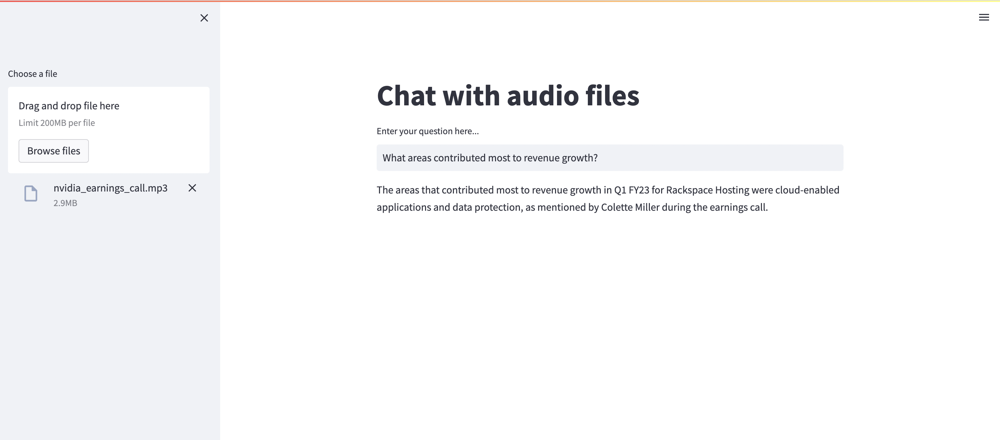

<head>
  <meta name="twitter:image" content="./banner.jpg"/>
</head>

## Financial background information

Publicly tradable companies are required to show investors how they are doing from a business and financial standpoint. Most of the information that investors are looking for can be found in a document called the 10-Q (Quarterly earnings report) and the 10-K (Annual earnings report ).

Usually, companies have an earnings call live with their investors and then publish their earnings reports afterward. So the people that get on the earnings call have a head start and get to know the information in real-time.

> What if I told you that there was a way to capture all of the data from a live earnings call without having to sit through the entire thing?

## Using AI to process financial data

The open-source AI model [Whisper Tiny](https://doi.org/10.48550/arXiv.2212.04356) can convert audio into text. This model is small enough to run on your CPU and can process hours of audio quickly (in seconds) and accurately.

Going back to the earnings call, we can use Whisper Tiny to convert the audio into text which we can process later on. We can then build a chatbot to "chat" with the text related to a company's finances. 

Using this technology, investors would be able to ask the chatbot questions like Where has the revenue grown most this year? or What was the net revenue for the quarter? This allows people to analyze the performance of a publicly traded company in near real-time without having to wait for the earnings report to get published.

## The application

Here are the steps required to build this app:
1. Run the Whisper Tiny model locally
2. Send the audio file to the model and get the converted text
3. Split the text into chunks using [LangChain](https://github.com/langchain-ai/langchain)
4. Store the chunks inside a vector database provided by [Weaviate](https://github.com/weaviate/weaviate)
5. Query the data stored in the vector database
6. Chat with the data using an open-source LLM, in this case [Vicuna](https://vicuna.lmsys.org)

There are quite a few technologies here and it can be difficult to run them manually. This is where Prem AI comes in. Prem AI allows people to easily deploy open-source tools and models without having to deal with any infrastructure.


We can run the Whisper Tiny model, Weaviate vector database, open-source embeddings tool, and the open-source Vicuna LLM all through Prem AI. 

### Let's get started!

<hr />

## Step 1: Project setup

First make sure you have Prem running locally and set up the instances for Whisper Tiny, Weaviate, Vicuna, and All MiniLM. 

There are a variety of services you can use from Prem such as vector databases and open-source LLMs. The way you interact with each service is mostly the same. For example, if you wanted to use the Vicuna 7B LLM you would first install the prem app and on the dashboard you would see the Vicuna 7B model.

Each service runs as a seperate docker container and they can easily be started or stopped via the desktop app.

If you click on a service that is running, you can see the documentation on how to use that service as well as some information about the docker container. Notice the `Default External Port`, which tells us which port our service is running on. This will be useful later on in the tutorial when we connect to each of these services via an API endpoint.

Next, let's install some Python dependencies:

```sh
pip install langchain openai streamlit
```

## Step 2: Transcribe audio to text

For this app, we'll be uploading an MP3 file containing the audio for Nvidia's earnings call using the Streamlit UI.

```python
import openai
import os
from langchain.embeddings import OpenAIEmbeddings
from langchain.text_splitter import RecursiveCharacterTextSplitter
from langchain.docstore.document import Document
from langchain.vectorstores import Weaviate
from langchain.chat_models import ChatOpenAI
from langchain.schema import HumanMessage

import tempfile
import streamlit as st

os.environ["OPENAI_API_KEY"] = "random-string"

embeddings = OpenAIEmbeddings(openai_api_base="http://127.0.0.1:8444/v1")
weaviate_url = "http://127.0.0.1:8080"

def convert_audio_to_text(audio_file_path) -> str:
    openai.api_base = "http://127.0.0.1:10111/v1"
    openai.api_key = "random-string"

    audio_file = open(audio_file_path, "rb")
    transcript = openai.Audio.transcribe("whisper-1", audio_file)
    return transcript.get('text')
```

The `convert_audio_to_text` function takes in a path to an audio file as an argument and then used the OpenAI Whisper Tiny model running locally to transcribe the audio to text.

You can call the `convert_audio_to_text` function and give it the path to the mp3 file if you want to test out the function.

I have a sample MP3 file which is a shortened version of an Nvidia earnings call which you can download at this [repo](https://github.com/htrivedi99/prem-blogs/blob/main/quarterly-earnings-chatbot/nvidia_earnings_call.mp3)

## Step 3: Chunk the text

Now that we have the text from the previous step we need to split it into multiple chunks. An earnings call is typically an hour long, so you don't want to process a giant text blob.

Instead, if you can cut the text blob into multiple pieces, it becomes much easier to process and query.

```python
def create_chunks(text_blob: str):
    text_splitter = RecursiveCharacterTextSplitter(
        chunk_size=500,
        chunk_overlap=20,
        length_function=len
    )

    texts = text_splitter.create_documents([text_blob])
    return texts
```

## Step 4: Load the chunks into Weaviate vector store

```python
def add_to_vectorstore(texts):
    embeddings = OpenAIEmbeddings(openai_api_base="http://127.0.0.1:8444/v1")
    documents = []
    for t in texts:
        doc = Document(page_content=t.page_content)
        documents.append(doc)

    vectorstore = Weaviate.from_documents(
        documents,
        embeddings,
        weaviate_url=weaviate_url,
        by_text=False,
    )
    return vectorstore
```

We want to store the chunked text so that we can query it later on. We can use Langchain's `Weaviate.from_documents` method to easily upload our text into our Weaviate vector database.

The chunked text gets stored as vectors inside the vector store and we use the All MiniLM embeddings endpoint running via Prem AI to convert our text into vectors.

## Step 5: Query the vector store

```python
def query_vectorstore(query: str, vectorstore):
    embeddings = OpenAIEmbeddings(openai_api_base="http://127.0.0.1:8444/v1")
    context = ""
    query_vector = embeddings.embed_query(query)
    docs = vectorstore.similarity_search_by_vector(query_vector, k=1)
    for doc in docs:
        context += doc.page_content
    return context
```

Once our text vectors are loaded into Weaviate, we can query against them using the `similarity_search_by_vector` function. Here's how this works:

* First, we take our input text such as a question, and convert it into a vector using the `embeddings.embed_query` method
* Next, we search through our vector database to find vectors that are similar to our input query vector
* Once we've found similar vectors, we take the original text from those documents and return all of the combined text


## Step 6: Bring it all together with Streamlit

Until this point, you've seen how the functions work. Now it's time to bring it all together by building an awesome UI for our app using Streamlit.

```python
st.title('Chat with audio files')
with st.sidebar:
    upload_file = st.file_uploader("Choose a file")
    if upload_file is not None:
        print(upload_file)
        with tempfile.NamedTemporaryFile() as tmp:
            tmp.write(upload_file.read())
            text_blob = convert_audio_to_text(tmp.name)
     
            print("text blob converted!")
            chunks = create_chunks(text_blob)
            print("created chunks!")
            vector_db = add_to_vectorstore(chunks)
            print("added to vector db!")

user_input = st.text_input('Enter your question here...')
if user_input:

    context = query_vectorstore(user_input, vector_db)
    print("context: \n")
    print(context)
    print("\n")

    chat = ChatOpenAI(openai_api_base="http://127.0.0.1:8111/v1", max_tokens=256)

    content = "Use the context below to answer the question.\n" \
              f"Context: {context}. \n" \
              f"Question: {user_input}"

    messages = [
        HumanMessage(content=content)
    ]
    print("generating...")
    res = chat(messages)
    print(res)
    st.write(res.content)
```

We use the Vicuna-7B LLM to chat with our data. In order for our LLM to answer our questions correctly, we need to provide it with some context surrounding the question.

The text we queried from our vector database will serve as our context. By providing a simple prompt like:

```txt
"Use the context below to answer the question.\n" \
f"Context: {context}. \n" \
f"Question: {user_input}"
```

Vicuna-7B is able to answer the question to the best of its ability given the context.

To run your Streamlit app use the following command:
```sh
streamlit run whisper_test.py
```

If your Python script is called something other than whisper_test.py then replace it in the command above.

After running the command above, you should see your Streamlit app running in your web browser!

If you would like to see the full code for this tutorial check out this [Github Repo](https://github.com/htrivedi99/prem-blogs/tree/main/quarterly-earnings-chatbot)

<hr />

## Conclusion

In this blog post, we took a practical use case such as extracting info from an earnings call, and applied state-of-the-art AI techniques to convert an audio file to text, load the text into a vector database, and finally query the text using an open-source LLM.

The applications for this project go well beyond just earnings calls, as any kind of audio can be processed using the techniques shown above. For example, you can summarize a video call or convert a youtube video into text.

Using Prem AI you can easily mix and match open-source AI tools to help you build applications for your particular use case.
