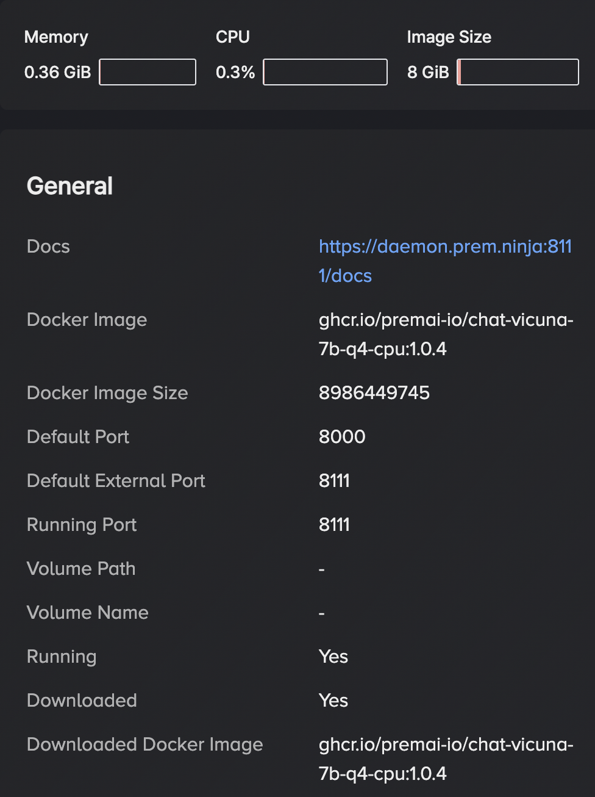

<!--truncate-->


<head>
  <meta name="twitter:image" content="./banner.png"/>
</head>

## Financial Use Case

Publicly traded companies are required to report to their investors. In the US, companies typically have a live call with their investors before publishing quarterly ([10-Q](https://www.investor.gov/introduction-investing/investing-basics/glossary/form-10-q)) and annual ([10-K](https://www.investor.gov/introduction-investing/investing-basics/glossary/form-10-k)) earnings reports. People on the call receive important information quicker than those who wait for written reports.

> Can we capture all the information from a live earnings call without having to sit through the entire thing or wait for official written reports?

Yes!

## Processing Audio with AI

The open-source [Whisper Tiny](https://doi.org/10.48550/arXiv.2212.04356) model can convert audio into text. This model is small enough to run on your CPU and can process hours of audio quickly (in seconds) and accurately.

We can then use an open-source large language model (LLM) such as [Vicuna](https://vicuna.lmsys.org) to query or "chat" with the text in a more human-friendly way than a basic `Ctrl + F` ever could. We could ask questions like "where has the revenue grown most this year?" or "what was the net revenue for the quarter?"

The steps required to build this app are:

1. Serve the Whisper Tiny audio-to-text model locally
2. Send our audio file to the model and receive the resulting text
3. Split the text into manageable chunks using [LangChain](https://github.com/langchain-ai/langchain)
4. Store the chunks inside a vector database provided by [Weaviate](https://github.com/weaviate/weaviate)
5. Query the data stored in the vector database
6. Chat with the data using the Vicuna LLM

There are quite a few technologies here and it can be difficult to run them all manually. We'll use Prem AI to easily handle most of this without having to wrestle with any setup -- including the Whisper Tiny model, Weaviate vector database, embeddings tool, and the Vicuna LLM.

## Step 1: Setup Requirements

Simply [install & run the Prem App](https://dev.premai.io/docs/category/installation). Using the app's UI, start these services:

- [Whisper Tiny](https://registry.premai.io/detail.html?service=whisper-tiny) (under *Audio-to-Text*),
- [All MiniLM L6 v2](https://registry.premai.io/detail.html?service=all-minilm-l6-v2) (under *Embeddings*),
- [Weaviate](https://registry.premai.io/detail.html?service=weaviate) (under *Vector-Store*), and
- [Vicun-7B q4](https://registry.premai.io/detail.html?service=vicuna-7b-q4) (under *Chat*).

Note that there are many other services you could select from instead (e.g. a larger *Chat* model if your GPU memory is large enough).

 <!-- width: 800 height: 400-->

Each service runs in a Docker container, and can be started/stopped via the app.

 <!--width: 350, height: 500-->

Click on a running service to see usage docs and Docker container info. Notice the `Default External Port`, which we will use below to interact with each of these services via their API endpoints.

Next, install some Python dependencies:

```sh
python -m pip install langchain openai streamlit
```

## Step 2: Transcribe Audio to Text

We'll create a `convert_audio_to_text` function which sends a given audio file to our Prem AI managed audio-to-text model, and returns the transcribed text.

```python
import os
import openai
from langchain.embeddings import OpenAIEmbeddings

# URL API endpoints obtained from the Prem App UI
whisper_url = "http://127.0.0.1:10111/v1" # audio-to-text
embeddings = OpenAIEmbeddings(openai_api_base="http://127.0.0.1:8444/v1")
weaviate_url = "http://127.0.0.1:8080" # vector store
vicuna_api = "http://127.0.0.1:8111/v1" # LLM
openai.api_key = os.environ["OPENAI_API_KEY"] = "random-string"

def convert_audio_to_text(audio_file_path) -> str:
    openai.api_base = whisper_url
    with open(audio_file_path, "rb") as audio_file:
        transcript = openai.Audio.transcribe("whisper-1", audio_file)
        return transcript.get("text")
```

## Step 3: Split Text into Chunks

We define a `create_chunks` function to split the text into smaller pieces which are much easier to process.

```python
from langchain.text_splitter import RecursiveCharacterTextSplitter

def create_chunks(text: str):
    text_splitter = RecursiveCharacterTextSplitter(
        chunk_size=500, chunk_overlap=20, length_function=len)
    return text_splitter.create_documents([text])
```

## Step 4: Save Chunks into Vector Store

An `add_to_vectorstore` function will save the chunks in our Prem-managed vector store, making them easy to query later.

```python
from langchain.docstore.document import Document
from langchain.vectorstores import VectorStore, Weaviate

def add_to_vectorstore(texts) -> VectorStore:
    documents = [Document(page_content=t.page_content) for t in texts]
    return Weaviate.from_documents(
        documents, embeddings, weaviate_url=weaviate_url, by_text=False)
```

Note that the All MiniLM L6 v2 `embeddings` endpoint is used to convert our text into vectors.

## Step 5: Query the Vector Store

We can query against them using the `similarity_search_by_vector` function.

```python
def query_vectorstore(query: str, vectorstore: VectorStore) -> str:
    query_vector = embeddings.embed_query(query)
    docs = vectorstore.similarity_search_by_vector(query_vector, k=1)
    return "\n\n".join(doc.page_content for doc in docs)
```

Here's how this works:

- The input query (our question) is converted into a vector using `embeddings.embed_query`
- The vector database is searched for similar vectors
- The original text (corresponding to those vectors) is returned

## Step 6: Combine Everything in a ChatBot GUI

We'll select an `mp3` audio file to use via a Streamlit UI. In this case, we'll use [this audio snippet](https://github.com/htrivedi99/prem-blogs/blob/main/quarterly-earnings-chatbot/nvidia_earnings_call.mp3) extracted from [NVIDIA's recent Q4 2023 earnings call](https://www.youtube.com/watch?v=7qU_wzzYNJU).

Then we'll use the functions defined above to support an LLM-driven chatbot!

```python
import tempfile
import streamlit as st
from langchain.chat_models import ChatOpenAI
from langchain.schema import HumanMessage

chat = ChatOpenAI(openai_api_base=vicuna_api, max_tokens=256)
st.title("Chat with audio files")
with st.sidebar:
    upload_file = st.file_uploader("Choose an audio file")
    if upload_file is not None:
        with tempfile.NamedTemporaryFile() as tmp:
            tmp.write(upload_file.read())
            st.write("Converting audio to text...")
            text = convert_audio_to_text(tmp.name)
            st.write("... done!")
            chunks = create_chunks(text)
            vector_db = add_to_vectorstore(chunks)

user_input = st.text_input("Enter your question here...")
if user_input:
    context = query_vectorstore(user_input, vector_db)
    messages = [HumanMessage(content=(
        "Use the context below to answer the question.\n"
        f"Context: {context}. \nQuestion: {user_input}"))]
    st.write("Generating...")
    res = chat(messages)
    st.write(res.content)
```

To answer our questions correctly, we need to provide the LLM with some context.
This context is given by the text we obtained from our vector database from a similarity search (finding transcribed audio extracts similar to our question).

To run everything, place all the Python code above into a file `audiobot.py` and run it using `streamlit`:

```sh
streamlit run audiobot.py
```

A browser window should open displaying your shiny new audio transcription chatbot app!

The [full source code for this tutorial is available here](https://github.com/htrivedi99/prem-blogs/tree/main/quarterly-earnings-chatbot).

## Conclusion

We took a practical use case -- extracting information from an earnings call -- and applied state-of-the-art AI techniques to convert the audio stream into text, and load the text into a vector database. We asked questions about the text in natural (human) language, and used a vector similarity search and an LLM to answer these questions.

The applications for this project go well beyond just earnings calls, as any kind of audio can be processed. For example, you can summarise a video recording from a meeting, lecture, or even YouTube.

Using Prem AI you can easily experiment with different open-source AI building blocks to help you build applications for your particular use case.
