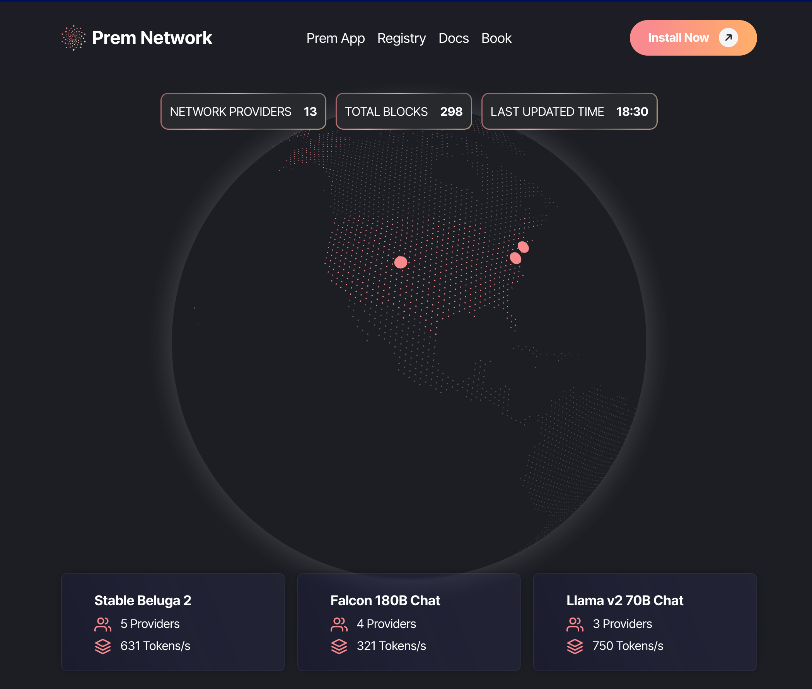

<!--truncate-->

<head>
  <meta name="twitter:image" content="./image.png"/>
</head>

We're thrilled to announce the launch of the [Prem Network](https://premai.io/prem-network), a peer-to-peer network poised to transform the landscape of open source AI. Building upon the foundations laid by our recently updated [Prem App](../2023-11-15-prem-app-v0.2-released/index.md), the Prem Network is seamlessly integrated into the app, enabling users to leverage the network's for inference and fine-tuning, split accross multiple devices.

<!--truncate-->

## The Vision of Prem Network

Our vision with the Prem Network is to break down the barriers in AI processing. It leverages a distributed mesh of GPU providers to optimize the processing of large, open-source models. This means individuals and smaller companies can now compete on the same playing field as 'Big AI', using technology that was previously out of reach.

## How It Works

The network operates on a simple yet effective principle: process sensitive layers locally while offloading additional workloads to peers across the network. This peer-to-peer swarm networking approach enables users to increase the size of models they can run locally, effectively turning multiple devices into a singular, powerful computational resource.
Integral to the Prem Network's prowess is its innovative tech stack, comprising Petals, Hivemind, and LibP2P. These cutting-edge technologies synergize to provide a robust and efficient backbone for our network.

- [Petals](https://petals.dev): You can then run large language models at home, BitTorrent‑style. The most sensitive model layers run locally, and the network will automatically fetch the other layers from other peers.

- [LibP2P](https://libp2p.io): A foundational element, LibP2P underpins our network's communication infrastructure, ensuring secure and reliable peer-to-peer interactions within the network.

Together, these technologies empower the Prem Network to handle the complex demands of modern AI applications, making it a powerhouse for both individual enthusiasts and large-scale enterprises.

## Public explorer

In tandem with the Prem Network's launch, we're excited to unveil [Petals Explorer](https://network.premai.io) - a complementary user interface that synergizes with the Prem Network. Petals Explorer offers a unique approach to running large language models (LLMs) by adopting a BitTorrent-style distribution mechanism. This integration marks a significant stride in our mission to democratize AI. It allows users to effortlessly tap into the power of LLMs like Llama 2, Falcon, and BLOOM, ensuring efficient operation even on consumer-grade GPUs. The collaboration of Petals Explorer with the Prem Network epitomizes our commitment to accessible, open-source, and peer-to-peer AI solutions, setting a new standard in the AI community."

## Open to All

Echoing the inclusive spirit of our [Prem App v0.2](../2023-11-15-prem-app-v0.2-released/index.md), the Prem Network is accessible to both individuals and businesses. Whether you're an AI enthusiast, a researcher, a startup, or an enterprise, the network is designed to cater to your computational needs, without the cost and complexity of traditional setups.

## Supported Models and Security

The initial models available on the network, like Stable Beluga 2 and Falcon 180B, illustrate our commitment to providing a versatile range of options for various AI applications. Furthermore, the security of your data remains paramount, with sensitive data processed locally and only non-sensitive parts delegated to the network.

## Join the Network

 Whether you're [contributing GPU using the Prem Desktop App](https://dev.premai.io/docs/prem-app/network-mode/) or simply leveraging the network's capabilities to make peer-to-peer inference requests, the Prem Network is a powerful tool for democratizing AI. We're excited to see how the network will evolve as more users join the network and contribute their GPUs.
