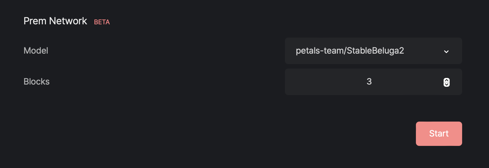
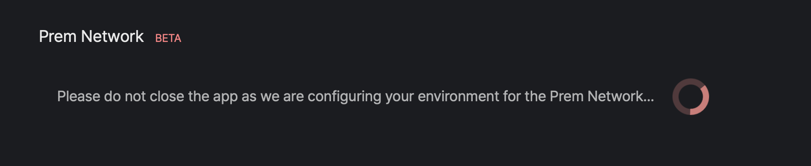

# Network Mode

If you have installed Prem App on your Mac with Apple Silicon, you can contribute to the Prem Network by running a Prem node on your machine. In order to do that, you can follow the instructions below.

## 1. Install Prem on your Mac

You must have Prem App installed on your MacOS with Apple Silicon [here](/docs/prem-app/installation/install-macos) in order to provide inference capacity to the Prem Network.

## 2. Join the Network

1. Click on `Settings` in the to and scroll down to `Prem Network` section.

- Select the Model you wanna contribute to.
- Select the number of blocks you want to contribute to.
- Click on `Start` button.

As soon as you Click on the `Start` button, the Prem App will start downloading the blocks from the network and will start contributing to the network. The process requires a coouple of minutes to complete. In the meantime, you will see the following message:

When the process is completed, a pop-up will appear with the following message:

## 3. Check your contribution

You can now go to https://network.premai.io to check your contribution to the network.

## 4. Stop contributing

You can always stop to contribute, clicking on the `Stop` button.

## 5. Delete the dependencies

If you want to delete the environment and start fresh, you can click on the `Delete` icon and the udnerlying dependencies will be deleted.

## 5. Make open-source AI a reality

You can now contribute to the Prem Network and help us to build the largest computer in the world to run AI inference with consumer devices.