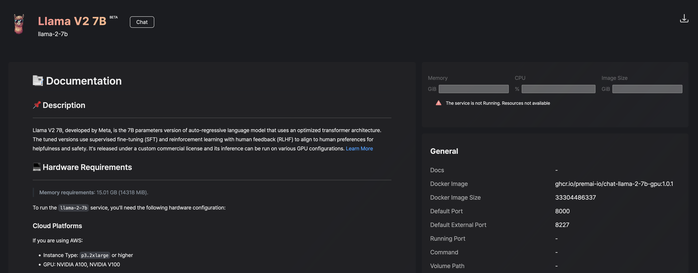

# Service Download Hanging

Prem is currently heavily based on Docker. Each service is a Docker container that is downloaded and run on your machine. Sometimes, the download of the container can hang. This is usually due to a network issue or the dimension of the container itself that could reach several GBs.

In order to fix that, what you can do is to pull the image manually.

Each service page has some general information. Among this information you can find the docker image used by the service. 



In the example above, the docker image is `ghcr.io/premai-io/chat-llama-2-7b-gpu:1.0.1`. You can `ssh` in your server where Prem is installed and run:

```bash
docker pull ghcr.io/premai-io/chat-llama-2-7b-gpu:1.0.1
```

When the download is completed, you will be able to check the service again and it will be ready to be run from Prem user interface.