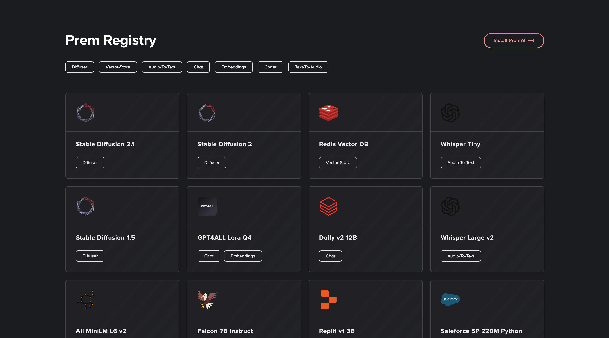

<head>
  <meta name="twitter:image" content="./registry.png"/>
</head>



The registry contains all the services available in the Prem Ecosystem. At https://github.com/premAI-io/prem-registry/tree/main you can see the latest stable version of the registry. We currently expose a UI as well in order for you to easily visualize all the available models https://registry.premai.io/.

## Add a Service

The following steps are necessary in order to submit a new service in Prem Registry.

### 1. Test

Before submitting the service, make sure that the image has been tested with the corresponding Prem Interface. 

In order to do that you will need to run the Prem Daemon with a different 

> We plan to release soon the possibility to upload a manifest from Prem App UI in order for developers to easily test their services without having to run Prem Daemon with a different environment variable.

### 2. Submit

When you are done with testing and you are confident that your service is ready for Prem, you can fork https://github.com/premAI-io/prem-registry/ and add a pull request against `dev` branch. Here the folders and files necessary for the pull request.

1. Create a folder with name: `{interface}-{service-id}`
2. Create the following files inside the folder:
    
    - `manifest.json`: a file specifying all the service metadata.

    ```json
    {
        "id": "dolly-v2-12b", // id of the service
        "name": "Dolly v2 12B", // name of the service
        "beta": true, // we suggest to put it as true meaning that is a new servcie
        "description": "Dolly-v2-12b, developed by Databricks, is an instruction-following large language model trained on diverse capability domains. It exhibits remarkable instruction following behavior, surpassing the foundation model it's based on, Pythia-12b. The model is particularly designed for commercial use and its inference can be run on various GPU configurations.", // service short description
        "documentation": "", // leave it blank, will be populated by the README.md
        "icon": "", // leave it blank, will be populated by the logo.svg absolute url
        "modelInfo": {
            "memoryRequirements": 24576, // amount of memory required in MiB
            "tokensPerSecond": 18 // if it's a text generative model the amount of tokens per second generated
        },
        "interfaces": [
            "chat" // list of interfaces the service is compatible with
        ],
        "dockerImages": {
            "gpu": { // where the docker image should run: gpu | cpu
                "size": 40689160223,
                "image": "ghcr.io/premai-io/chat-dolly-v2-12b-gpu:1.0.2"
            }
        },
        "defaultPort": 8000, // try to keep 8000
        "defaultExternalPort": 8333 // put a random number here
    }
    ```
    
    - `logo.svg`: a logo of your service in svg format 256x256.
    - `README.md`: documentation of the service, how to use it, tips and tricks, license. Provide all the insights and the information necessary to exploit the model at maximum capacity.

### 3. Deploy 🎉

The pull request will be reviewed by Prem team and merged accordingly. Automatically all the daemon using Prem Registry will have access to your service.

Congraulations 🎉 You have published your first Service in Prem Ecosystem.

## Disclaimer

> Prem is fully open source. You can run Prem Daemon using a different registry. In the Prem Daemon contribution [guide](https://github.com/premAI-io/prem-daemon#custom-registry) you can check how to do that.
